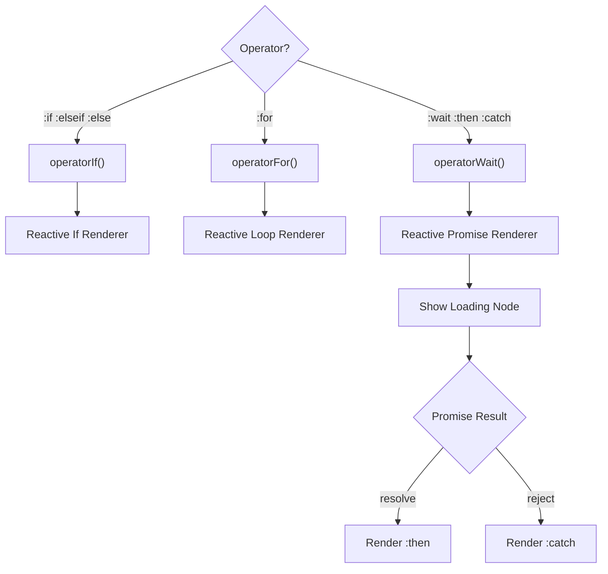
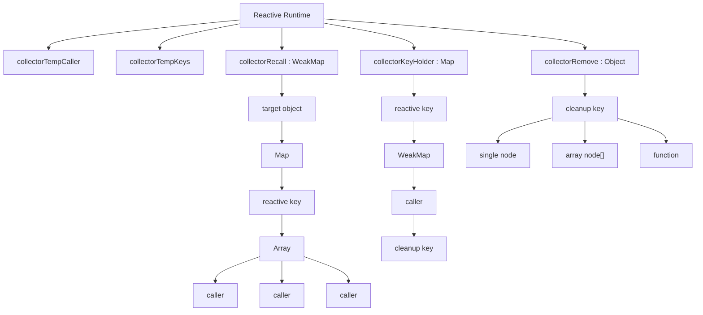
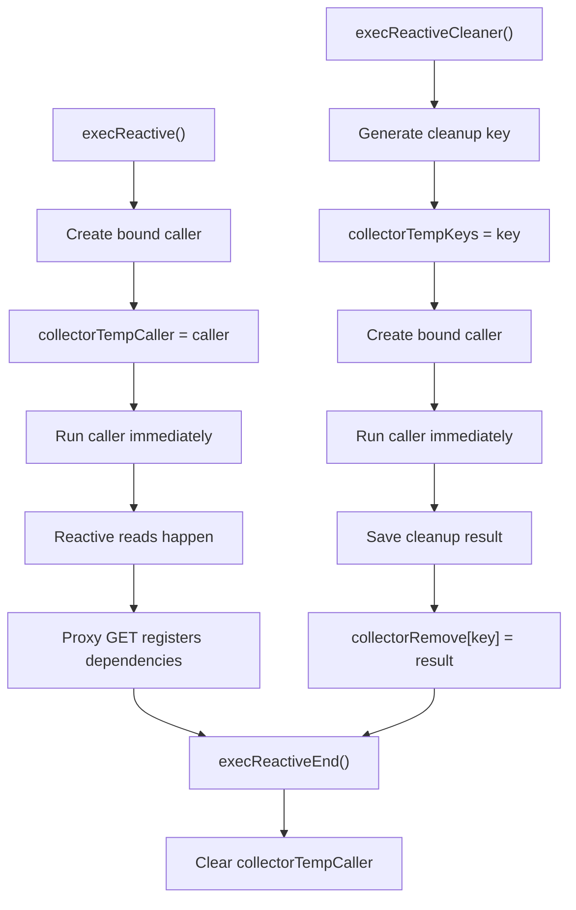
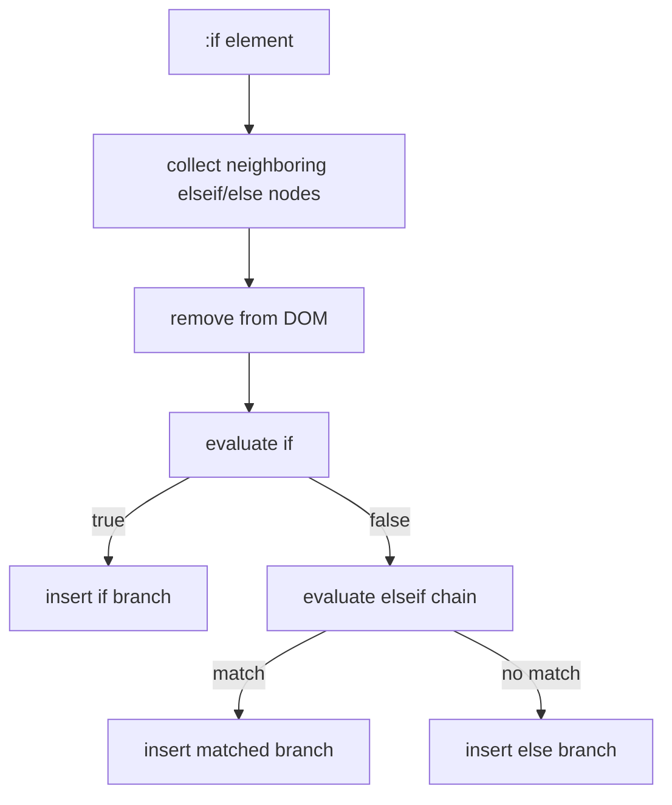
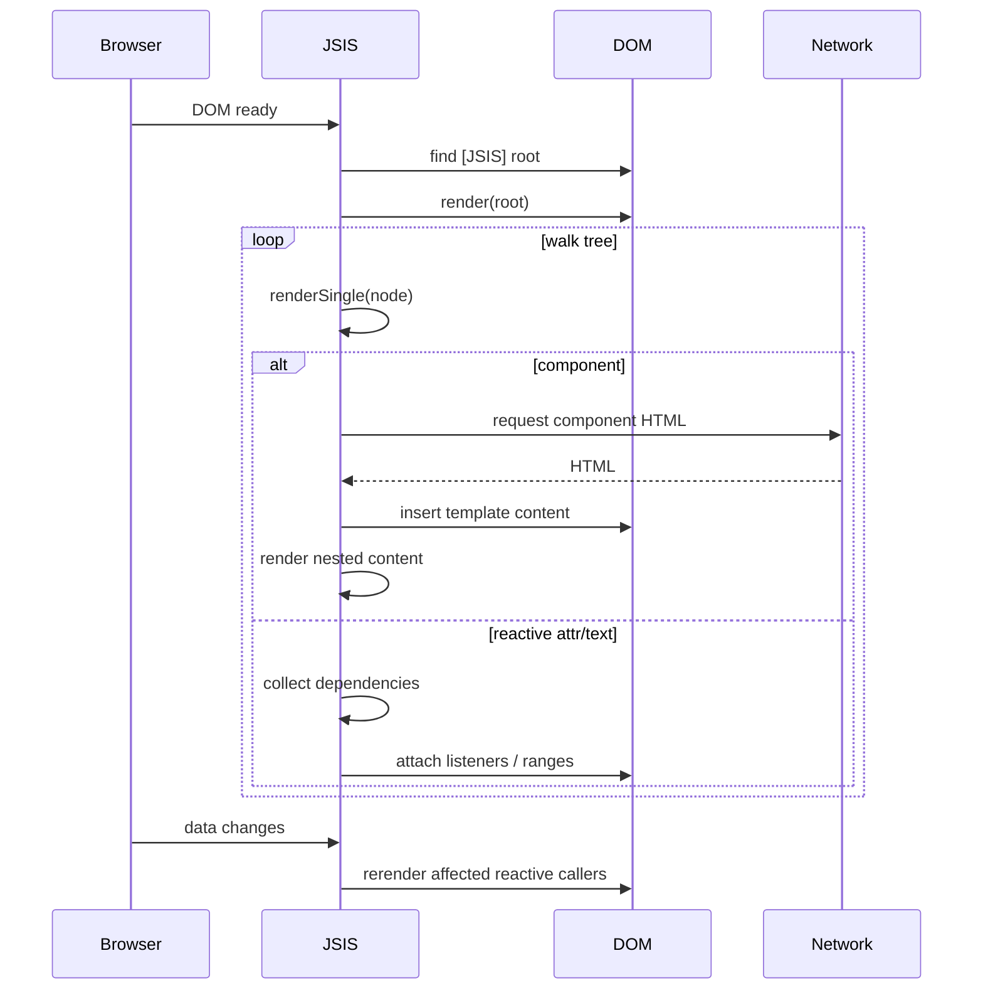

# JSIS Framework — Developer Guide

This is a compact client-side framework built around three ideas:

1. **Template rendering from the DOM**
2. **Reactive re-rendering when proxied data changes**
3. **Component files loaded over XHR with `<template>`, `<script>`, and `<style>` blocks**

It is not a virtual DOM framework. It works by **walking real DOM nodes**, attaching behavior, and re-inserting cloned nodes when reactive values change.


## Full JSIS Runtime Flow
 
### Render Flow

 ```mermaid
flowchart TD
    C["render(root, scope)"]
    C --> D["renderSingle(node)"]
    D --> E{"node type"}

    E -->|"SCRIPT"| ED["renderScript()"] 
    E -->|"COMP"| EA["renderComp()"]
    E -->|"TEXT"| EB["renderText()"]
    E -->|"ATTR"| EC["renderAttr()"]


    EC --> J["Operator Attributes"]
    EC --> I["Event Attributes"]
    EC --> K["Normal Attributes"] 
  
    EA --> AB["request(component.html)"]
    AB --> AC["Parse HTML"]

    AC --> AD["Extract Template"]
    AD --> AG["Insert Template"]
    AG --> AH["render(root, scope)"] 

    AC --> AE["Extract Scripts"]
    AE --> AI["execScript()"]

    AC --> AF["Extract Styles"]
    
 
    Q{"execReactive()"} 
 
    K --> Q
    EB --> Q

``` 

### Operator flow
 


### Reactive Data Structures



### Reactive Registration Lifecycle



## 1) Mental model

Think of JSIS as a small runtime that turns this:

```html
<div JSIS>
  Hello {user.name}
  <button @click="count++">Click</button>

  <div :if="count > 0">Count is {count}</div>

  <comp src="'/components/card.html'" :prop="{ title: 'Hello' }"></comp>
</div>
```

into:

* text interpolation
* event listeners
* reactive attribute updates
* conditional blocks
* loops
* async/promise blocks
* reusable components


## 3) Public API

The framework exposes:

```js
window.JSIS.create(element?, prop?)
window.JSIS.component(src, new_element, prop?, local_scope?)
```

### `create(element?, prop?)`

Bootstraps rendering.

* If `element` is not provided, it looks for the first element matching `*[JSIS]`.
* It starts rendering that root with a fresh scope.

### `component(src, new_element, prop?, local_scope?)`

Programmatic component rendering.

* Loads a component from `src`
* Renders it into `new_element`
* Uses `prop` as component props
* Uses `local_scope` to decide whether to inherit parent scope or isolate


## 4) Boot sequence

The file is an IIFE:

```js
window.JSIS = function () { ... return { component, create } }()
```

So the runtime is created immediately.

### Startup flow

1. `window.request` and `window.require` are attached globally.
2. Global scope containers are created.
3. Reactive proxy systems are created.
4. DOM ready is checked:

   * if already ready → `create()`
   * else wait for `DOMContentLoaded`


## 5) Scope system

JSIS uses a **5-slot scope array** everywhere:

```js
[
  {},                  // _
  collectorProxy({}),   // __
  scopeGlobal,          // _$
  scopeGlobalReactive,  // __$
  prop                 // prop
]
```

### What each slot means

| Slot   | Name   | Purpose                   |
| ------ | ------ | ------------------------- |
| `_[0]` | `_`    | plain local variables     |
| `_[1]` | `__`   | reactive local variables  |
| `_[2]` | `_$`   | plain global variables    |
| `_[3]` | `__$`  | reactive global variables |
| `_[4]` | `prop` | component props           |

### Resolution order inside expressions

Expressions are compiled like this:

```js
with(__$){
  with(_$){
    with(__){
      with(_){
        with(prop){
          return ...
        }
      }
    }
  }
}
```

So lookup priority is:

`prop` → `_` → `__` → `_$` → `__$`

That means component props can shadow local and global values.


## 6) Rendering pipeline

### Main rendering function

```js
render(element, local_scope)
```

It does:

1. `renderSingle(element, local_scope)`
2. Finds all descendant nodes matching `config.selector`
3. Calls `renderSingle()` for each one

This is a one-pass DOM walker.


## 7) What `renderSingle()` does

```js
function renderSingle(element, local_scope) {
    if (element.nodeName == "COMP") return renderComp(...)
    if (element.nodeName == "SCRIPT" && element.type.toUpperCase() == "JSIS") return renderScript(...)

    var attrs = element.getAttributeNames().join("")
    if (attrs.includes(":")) {
        if (!renderoperator(element, local_scope)) return
        renderAttr(element, local_scope)
    } else if (attrs.includes("@")) {
        renderAttr(element, local_scope)
    }

    renderText(element, local_scope)

    if (":load" in element.attributes) {
        renderAttrCustomEvent(element.attributes[":load"], local_scope)
    }
}
```

It handles:

* `<comp>` components
* `<script type="JSIS">`
* custom attributes like `:if`, `:for`, `:class`
* event attributes like `@click` and `:oninput`
* text interpolation
* custom `:load` hook


## 8) Text interpolation

### Syntax

JSIS scans text nodes for:

* `{expr}` → plain text insertion
* `${expr}` → HTML insertion

### Example

```html
<div>
  Hello {user.name}
  ${user.bioHtml}
</div>
```

### How it works

* Text nodes are scanned with a regex
* Each match is replaced by a `Range`
* A reactive effect is created for each expression
* On update, the framework:

  * removes the old inserted content
  * re-evaluates the expression
  * inserts new text or HTML

### Important detail

If the interpolation starts with `$`, it uses:

```js
range.createContextualFragment(text)
```

So the returned string is parsed as HTML, not text.


## 9) Attribute system

Attributes starting with `:` are treated as framework attributes.

Attributes starting with `@` or `:on` are treated as event listeners.

### Supported forms

| Syntax           | Meaning               |
| ---------------- | --------------------- |
| `:class="..."`   | reactive class object |
| `:style="..."`   | reactive style object |
| `:value="..."`   | reactive attribute    |
| `@click="..."`   | event listener        |
| `:onclick="..."` | event listener        |
| `:if="..."`      | conditional block     |
| `:for="..."`     | loop                  |
| `:wait="..."`    | promise block         |


## 10) Event handling

### `@event`

Example:

```html
<button @click="count++">Add</button>
```

### `:onevent`

Example:

```html
<input :oninput="value = event.target.value">
```

Both are converted into `addEventListener(...)`.

### Event script execution

Events are evaluated by `execEvent()`.

* If the script looks like a valid identifier, it is executed directly
* Otherwise it is wrapped as:

```js
function(event) { return (...) }
```

So `event` is available in the expression.


## 11) Reactive engine

This is the heart of the framework.

## Dependency tracking

JSIS wraps objects in a proxy:

```js
collectorProxy(target)
```

This proxy tracks:

* **reads** via `get`
* **writes** via `set`

### When a reactive value is read

`collectorProxyGetter()` registers the current reactive caller into:

```js
collectorRecall: WeakMap(target -> Map(key -> [callers]))
```

So the runtime knows which rendering function depends on which key.

### When a reactive value changes

`collectorProxySetter()`:

1. writes the new value
2. looks up all callers that depend on that key
3. re-runs them


## 12) Reactive caller lifecycle

### Internal Object Layout

```text
collectorTempCaller
└── current reactive callback

collectorTempKeys
└── current cleanup key


collectorRecall (WeakMap)
└── target object
    └── Map
        └── reactive key
            └── [
                caller,
                caller,
                caller
            ]


collectorKeyHolder (Map)
└── reactive key
    └── WeakMap
        └── caller
            └── cleanup key


collectorRemove (Object)
└── cleanup key
    ├── DOM node
    ├── DOM node[]
    └── cleanup function
```

Reactive rendering is done through:

* `execReactive()`
* `execReactiveCleaner()`
* `execReactiveEnd()`

### `execReactive(reactive, ...)`

* creates a bound callable
* stores it in `collectorTempCaller`
* runs it once immediately
* dependencies are collected during that run

### `execReactiveCleaner(reactive, ...)`

Same idea, but also stores the cleanup output in `collectorRemove`.

This is used by structural blocks like:

* `:if`
* `:for`
* `:wait`

These blocks need to remove old DOM before rebuilding.

### `execReactiveEnd()`

Clears the current collector context so future reads are not tracked accidentally.


## 13) Structural operators

These are the “control flow” features.


## 13.1 `:if`, `:elseif`, `:else`

### Example

```html
<div :if="loggedIn">Welcome</div>
<div :elseif="loading">Loading</div>
<div :else>Guest</div>
```

### Behavior

JSIS:

1. groups the `if` chain together
2. removes the nodes from DOM
3. evaluates the first condition
4. inserts the first matching branch
5. tracks it reactively

### Notes

* `:elseif` and `:else` are only valid after a preceding `:if`
* If they appear alone, JSIS logs an error

### Internal flow




## 13.2 `:for`

### Example

```html
<li :for="item in items">{item.name}</li>
```

or

```html
<div :for="i of list">{i}</div>
```

### Behavior

* The template node is removed
* A reactive loop is created
* Each iteration clones the template
* A loop variable is injected into `prop` scope

### What the loop callback receives

The loop engine extracts the loop variable name from the script and stores the current item under that key.

So inside the clone:

```js
scope[4][name] = index
```

That means `prop[name]` becomes the current value for that iteration.

### Important limitation

This is not a general-purpose parser. It uses a regex to guess the loop variable, so it works best for simple patterns like:

* `item in items`
* `item of items`


## 13.3 `:wait`, `:then`, `:catch`

### Example

```html
<div :wait="fetchUser()">
  Loading...
</div>
<div :then="user">
  Hello {user.name}
</div>
<div :catch="error">
  Failed: {error.message}
</div>
```

### Behavior

* Evaluate `:wait`
* If it returns a Promise:

  * render the wait element immediately
  * remove it when resolved/rejected
  * render `:then` or `:catch`
* If it returns a non-Promise:

  * render `:then` immediately with the value

### What happens on resolution

* `:then` gets the resolved value in its local prop variable
* `:catch` gets the rejection reason


## 14) Attribute value helpers

### `checkAttr(element, name, value)`

This helper handles special object values.

#### For `class`

```js
:class="{ active: isActive, hidden: isHidden }"
```

* adds class names whose values are truthy
* removes class names whose values are falsy

#### For `style`

```js
:style="{ color: 'red', display: 'none' }"
```

* sets style properties directly

#### For other attributes

If the value is an object, it returns the first truthy key.

Example:

```js
:src="{ '/a.png': isA, '/b.png': isB }"
```

The first truthy key becomes the attribute value.


## 15) Custom `:load` hook

If an element has `:load`, JSIS runs it once after attribute processing:

```html
<div :load="console.log('mounted')"></div>
```

This is useful as a mount-time hook.

It is **not reactive**.


## 16) Component system

This is one of the most important parts of the framework.


## 16.1 `<comp>` tag

A component is declared with a custom element named `COMP`.

Example:

```html
<comp src="'/components/card.html'" :prop="{ title: 'Hi' }"></comp>
```

### Supported component attributes

| Attribute | Meaning                                              |
| --------- | ---------------------------------------------------- |
| `src`     | static source URL                                    |
| `:src`    | reactive source URL                                  |
| `:prop`   | props object / expression                            |
| `:global` | inherit parent scope instead of creating a fresh one |


## 16.2 How component loading works

### Step-by-step

1. JSIS reads `src` or `:src`
2. It fetches the component file
3. It parses the returned HTML into a temporary container
4. It extracts:

   * `<template>`
   * `<script>`
   * `<style>`
5. It creates a new wrapper element
6. It inserts template content into the page
7. It renders the inner DOM recursively
8. It executes component scripts


## 16.3 Component scope rules

If `:global` is **not** present:

* the component gets a new local scope
* global scope is shared
* props are injected into the new scope

If `:global` **is** present:

* the component reuses the parent scope array
* only `prop` is replaced

So `:global` is really “inherit parent local scope”.


## 16.4 Script and style collection

`renderCompReactiveCodes()` collects all `<script>` and `<style>` blocks.

### Scripts

Scripts can be:

* inline
* remote via `src`
* marked with `:ready`

The runtime separates them into two groups:

* **before_load**
* **after_load**

### Styles

Styles are concatenated and inserted into the component root.


## 16.5 Important ordering feature

`orderCompLine()` ensures component loading callbacks run in the order they were requested, not in the order they finish fetching.

This is important because asynchronous requests may resolve out of order.


## 17) Script execution model

JSIS uses `new Function(...)` heavily.

### Main execution helpers

| Function        | Purpose                            |
| --------------- | ---------------------------------- |
| `execEval()`    | evaluate expressions               |
| `execEvent()`   | build event handlers               |
| `execLoop()`    | build loop executor                |
| `execScript()`  | run component script blocks        |
| `execRequire()` | execute CommonJS-style module text |


## 18) `execEval(script, scope, element)`

This is the general expression evaluator.

It wraps the expression inside nested `with(...)` blocks so expressions can refer to scope keys directly.

Example:

```js
{ count + 1 }
```

instead of:

```js
{ prop.count + 1 }
```

### Security note

This means JSIS executes arbitrary JavaScript from templates. That is powerful, but unsafe for untrusted content.


## 19) `request()` and `syncRequest()`

### `request(url, data, opt)`

Asynchronous XHR wrapper.

* GET if no data
* POST if data exists
* can send `FormData`
* can pass progress callbacks
* returns a Promise resolved with `response`

### `syncRequest(url, data, opt)`

Synchronous XHR wrapper.

* blocks the browser thread
* returns the response directly

### Important issue

`require(url)` is currently written as:

```js
function require(url) {
    return syncRequest(url).then(execRequire)
}
```

But `syncRequest()` returns a **plain response**, not a Promise.

So `require()` appears broken as written.


## 20) `execRequire(script)`

This tries to emulate CommonJS modules:

* creates a fake `module.exports`
* runs the script with `require` and `module`
* resolves the exported value

This is meant for loading JS modules over XHR.


## 21) Full render lifecycle

Here is the overall flow in one place:




## 22) Main strengths

### 1. Very small runtime

Everything is done with a single file and plain DOM APIs.

### 2. Reactive without a virtual DOM

The system directly re-renders affected regions.

### 3. Component model is file-based

Good for lightweight reusable UI pieces.

### 4. Scope is simple to understand

A single array carries all visible variable layers.

### 5. Built-in support for:

* loops
* conditionals
* async/promise blocks
* text interpolation
* HTML interpolation
* event binding
* component loading


## 23) Main limitations and sharp edges

These are important for developers to know.

### 1. `with(...)` + `Function(...)`

This is flexible, but:

* slow compared to normal code
* hard to debug
* unsafe for untrusted templates

### 2. Dependency tracking is broad, not precise

The proxy system records reads, but it does not deduplicate callers in a very strict way.

That means repeated reads can register repeated watchers.

### 3. Some DOM insertion logic is fragile

For example, in `:for`, inserting when there is no sibling may fail because of how `last.nextSibling` is used.

### 4. `require()` appears incorrect

It uses `.then(...)` on a synchronous return value.

### 5. Component script flow looks incomplete

`renderCompReactiveCodes()` splits scripts into before/after groups, but the final call chain suggests the “after” function may not actually be invoked in the current implementation.

### 6. Structural parsing is regex-based

` :for` and some other logic depend on regex guessing rather than full syntax parsing.


## 24) Likely bugs or design issues

These are the most notable ones from the code itself.

### A. `require()` bug

```js
return syncRequest(url).then(execRequire)
```

But `syncRequest()` returns a string/response, not a Promise.

### B. Possible `:for` empty-parent crash

This part can fail when there is no sibling:

```js
if (last == null) last = parent.firstChild
last = parent.insertBefore(element.cloneNode(true), last.nextSibling)
```

If `last` is still `null`, `last.nextSibling` throws.

### C. Potential duplicate watcher registration

Every reactive read can push the same callback again.

### D. Component “after” code likely not executed

The script pipeline returns nested functions, but the final function may not be invoked.

### E. Synchronous XHR is used

`syncRequest()` blocks the browser, which is generally discouraged.


## 25) Developer usage guide

### Basic page bootstrap

```html
<div JSIS>
  Hello {name}
</div>

<script>
  window.JSIS.create(undefined, { name: "World" })
</script>
```

### Reactive data

Use the reactive scope objects for watched state.

The important idea is:

* read reactive values inside a reactive render
* write reactive values later
* JSIS re-runs the affected renderers

### Conditionals

```html
<div :if="count > 0">Positive</div>
<div :else>Zero or negative</div>
```

### Loops

```html
<li :for="item of items">{item.title}</li>
```

### Async

```html
<div :wait="loadData()">
  Loading...
</div>
<div :then="result">
  {result}
</div>
<div :catch="err">
  {err}
</div>
```

### Component example

```html
<comp src="'/components/user-card.html'" :prop="{ user: currentUser }"></comp>
```


## 26) Suggested internal structure for maintainers

If you are documenting or refactoring this framework, this is a clean way to think about it:

```text
JSIS
├── boot
│   ├── create()
│   └── DOMContentLoaded startup
├── render
│   ├── render()
│   ├── renderSingle()
│   ├── renderText()
│   ├── renderAttr()
│   └── renderComp()
├── operators
│   ├── :if / :elseif / :else
│   ├── :for
│   └── :wait / :then / :catch
├── reactivity
│   ├── collectorProxy()
│   ├── dependency map
│   ├── execReactive()
│   └── cleanup system
├── components
│   ├── fetch component file
│   ├── parse template/script/style
│   └── render component scope
└── utilities
    ├── request()
    ├── syncRequest()
    ├── execEval()
    ├── execEvent()
    └── execLoop()
```


## 28) Summary

JSIS is a lightweight DOM-driven reactive framework with:

* expression interpolation
* reactive attribute binding
* event binding
* conditionals
* loops
* async blocks
* file-based components
* a proxy-based dependency tracker
 
 
